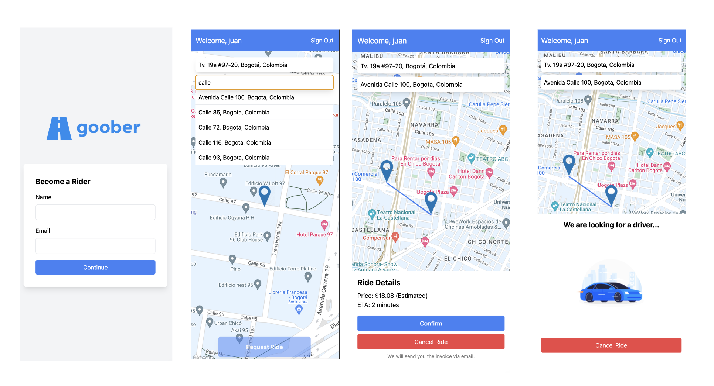

# Goober Webapp - Juan Diego Sanchez ⚡

A comprehensive solution addressing the challenges of ride-sharing, Goober provides a seamless experience for admins, riders, and drivers.

## Tech Stack

Initiated with `create-t3-app`, our tech foundation includes Typescript, React, Next.js, and Tailwind for styling. Moreover, tRPC streamlines TypeScript calls and Supabase augments SQL operations, Cron jobs, and real-time functionalities.

## Demo 

See demo in: [https://goober-jd.vercel.app/](https://goober-jd.vercel.app/))

## Running the Project Locally

To get started with T3, run `npm install` followed by `npm start`. Remember to set your `.env` variables:

```
NEXT_PUBLIC_SUPABASE_URL=example
NEXT_PUBLIC_SUPABASE_ANON_KEY=example
NEXT_PUBLIC_GOOGLE_MAPS_KEY=example
```

## Product Specs

Designed with the needs of each stakeholder in mind, Goober aims to ensure success right from launch. The platform is built with admins' operational needs, riders' effortless ride requests, and drivers' easy earnings in mind.

A detailed overview follows, covering user experiences, technical nuances, considered trade-offs, and future prospects. Pertinent assumptions and FAQs are also addressed.

Integrated a view for users to select the roles:


<p align="center">

</p>

### Admin Experience

Optimized for desktop, anticipating that most admin tasks are undertaken at workstations, whether at office spaces or homes.


1. **Onboarding & Authentication**: While the current version lacks authentication, future iterations will ensure data security for internal users with role-based access controls.

2. **Pricing Mechanics**: The inaugural version uses a basic formula: `BASE_FARE + distancePrice + timePrice` to determine ride charges. Admins can dynamically set base fare, price per km/minute, and company commission from each ride.

   _Future_: Incorporate factors like weather, traffic, and surge pricing. Admins might only need to tweak minor variables.

3. **Dashboard**: Offers insights into revenue and profits over varying periods. Additionally, active and completed rides provide a snapshot of the platform's pulse.

   _Future_: Integrate richer metrics like user activity rates, more granular profit calculations, and visual tools like graphs.

4. **Ride Management**: Allows ride oversight and the option to cancel ongoing rides. Real-time tracking was omitted in favor of ride status priority.

   _Future_: Features like filters, search, direct communication with riders/drivers, re-assignment capabilities, and compensation tools could be added.

**Open Questions**:

1. How should the platform manage and monitor driver performance and ratings to ensure quality service?
2. How should potential disputes between drivers and riders be managed and resolved by the admin?
3. How does Goober differentiate itself in terms of features and user experience from other ride-sharing apps?
4. How does Goober plan on generating revenue? Will there be other monetization strategies besides taking a commission from rides?
5. Is there a plan to offer promotional offers or discounts to boost ridership, and how would that impact the company's revenue model?
6. Is there a consideration for partnerships with other businesses or services to enhance Goober's offerings?

### Rider Experience

Tailored for mobile platforms, the rider interface ensures ride bookings on-the-go. It's modular enough to be repurposed for React Native if a native app is envisioned.



1. **Onboarding & Authentication**: A simple form captures essential details. Location permissions enhance user experience. Session persistence is a feature for the future.

   _Future_: Introduce extended authentication like social sign-ins and magic links.

2. **Ride Request**: Users define pickup and drop-off points, with a visual route (albeit not the final one) displayed on Google Maps.

   _Future_: Allow map interaction for location selection, real-route rendering, and favorite address storage.

3. **Ride Quotation**: Upon request, users receive a ride estimate based on time and distance. Backend storage for these quotations is on the future roadmap.

   _Future_: Adopt more accurate pricing and ETA algorithms.

4. **Ride Status**: Post-booking, riders receive live updates on their ride, from driver assignment to trip completion.

   _Future_: Offer real-time driver tracking with clear ETAs and better feedback mechanisms.

5. **Post-Ride Summary**: After completion, the exact fare based on time and distance is displayed.

   _Future_: Introduce a ride history section.

**Open Questions**:

1. How should we manage rider payments in terms of methods and user experience?
2. Should there be a direct line to support for riders?
3. Is there a need for saving favorite addresses or previous rides for riders?
4. Could tip options for drivers enhance the rider experience and boost driver performance?
5. Is there potential for implementing shared rides or carpooling options for users who want a more economical option?

### Driver Experience

Molded for mobile platforms with the understanding that drivers are typically on the move.


1. **Onboarding & Authentication**: Essential details and location permissions are captured. Session continuity is a potential future addition.

   _Future_: Introduce advanced authentication tools like social sign-ins and magic links.

2. **Dashboard**: Drivers can view their earnings and toggle their availability. Real-time location is broadcasted for ride assignment when available.

3. **Ride Assignments**: Available rides are displayed. Accepting a ride provides complete details and opens Google Maps for navigation.

4. **Ride Completion**: Profits are showcased after each trip's conclusion.

5. **Ride History**: An overview of past rides and earnings is accessible.

**Open Questions**:

1. Should we implement a KYC process for driver verification to ensure rider safety?
2. Would a dedicated support section for drivers be beneficial?
3. Should drivers be notified about tips received?
4. Would an embedded map within the app, negating the need for Google Maps, enhance the driver's experience?
5. How should feedback and ratings for drivers be managed to ensure transparency and fairness?
6. Are there considerations for driver benefits or insurance options as part of their association with Goober?
7. What safety measures can be implemented for the drivers in case of unruly passengers?

### Additional Features

**Ride Assignment Algorithm**: A Supabase-powered Cron job scans for unassigned rides every minute. The closest available driver within a 2km radius is selected.

_Future_: The assignment algorithm could be optimized, considering variables beyond proximity. Also, while Supabase suffices for the MVP, a more robust tool might be needed for scalability.
